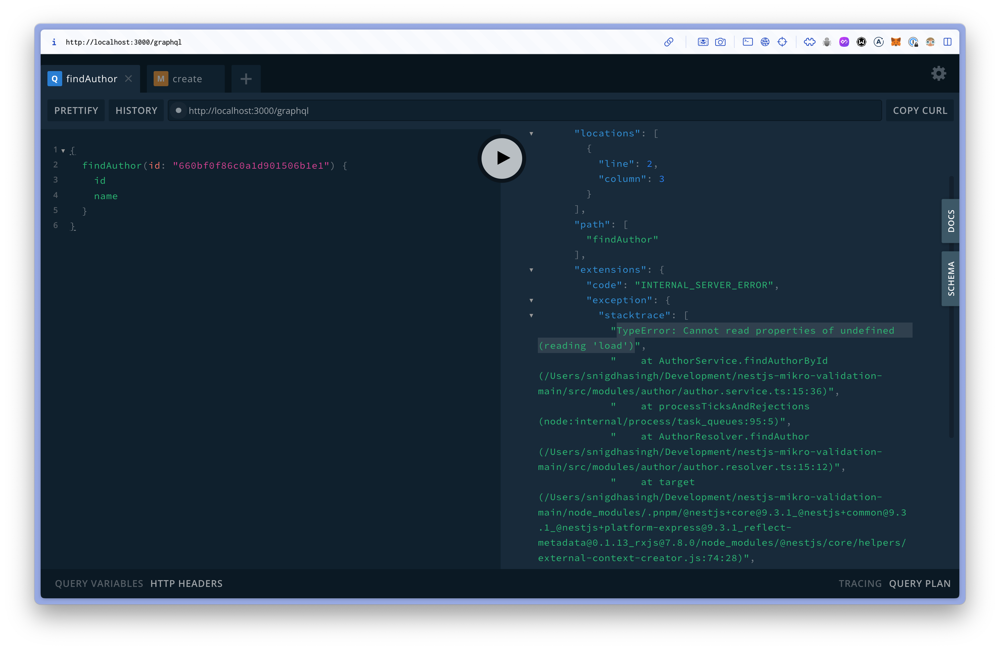

# The problem

- I have a 1-1 relation between Author and Book.
- A book has an author, and it is the owning side of the relation.
- An author can have a book, but it is not required.
- When I try to load a book from an author, I get the following error:

```typescript
const book = await author.book.load(); // Error: Cannot read properties of undefined (reading 'load')
```

I expect it to return null if the author does not have a book.

## Steps to reproduce

1. Run `pnpm start:dev` in the root
2. Access the GraphQL playground at http://localhost:3000/graphql
3. Create an author and book in the GraphQL playground:

```graphql
mutation create {
  createAuthor {
    id
    name
  }
}

```

Copy the author ID and query the author:

```graphql
{
  findAuthor(id: "YOUR_ID") {
    id
    name
  }
}
```

This also tries to load the book from the author, but it will fail.
You'll get the error:

```bash
TypeError: Cannot read properties of undefined (reading 'load')
```

However we can load the book from the BookRepository, and we can do book.author.load() without any issues.


